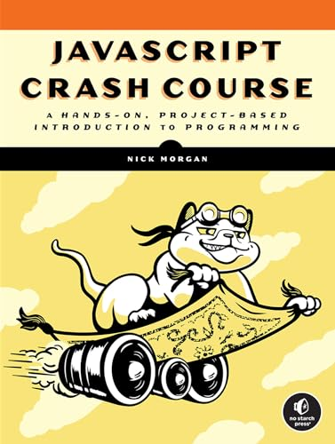
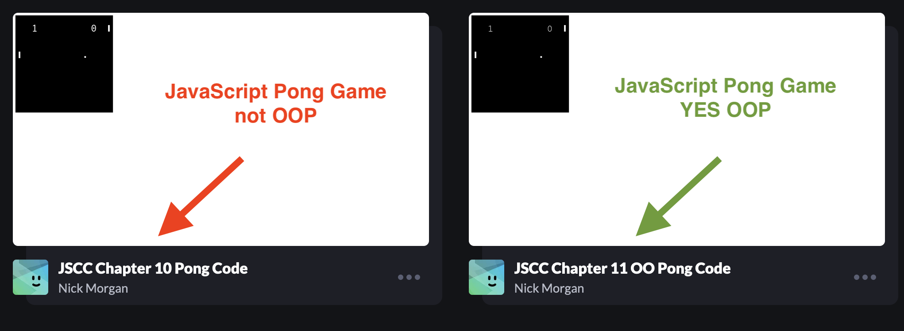

# OOP Session Files and Notes

## Quick Look at JavaScript and how it is very similar to Python

Last week I held up this book for you to see: [*JavaScript Crash Course* by Nick Morgan (Link to Wake Co. Libaries)](https://catalog.wake.gov/Record/782490?searchId=117195283&recordIndex=1&page=1). I mentioned how much I like the [no starch press](https://nostarch.com/) books. 



I don't own it, I checked it out from the Wake County Library. I searched to see if there was an online version, but I did not find one, but I did find the book for sale at [Amazon](https://www.amazon.com/JavaScript-Crash-Course-Nick-Morgan/dp/1718502265/) and at [no starch press](https://nostarch.com/javascript-crash-course).

UNC does not have a copy of JavaScript Crash Course by Morgan, but is does have another book by Morgan: [JavaScript for Kids: a Playful introduction (link to UNC Ebook Central)](https://ebookcentral.proquest.com/lib/unc/detail.action?docID=1931669). This is even better because it is at a level for kids! You cannot download the entire book as pdf, but you can get chapters. I downloaded three chapters to reference because it is very helpful for us to see how JavaScript handles Object Oriented programming. (It is very similar to Python as I have already mentioned.) And because it is for kids, it is really clear.


* [JavaScript_for_Kids_03_Arrays.pdf](./js_for_kids/JavaScript_for_Kids_03_Arrays.pdf)       
* [JavaScript_for_Kids_04_Objects.pdf](./js_for_kids/JavaScript_for_Kids_12_Object-Oriented_Programming.pdf)
* [JavaScript_for_Kids_12_Object-Oriented_Programming.pdf](./js_for_kids/JavaScript_for_Kids_12_Object-Oriented_Programming.pdf)

This book was published in 2014, so it is out of date with new varible keywords introduced in 2015. See TLDR; below.

The author is Nick Morgan and he is a software engineer at X (Twitter) and he also writes in [Scala](https://docs.scala-lang.org/tour/tour-of-scala.html). Incidentally, I mentioned [here](https://docs.google.com/presentation/d/1TaoSx1kaDwMoERzsWfSrAt8sDnAi5_JtCGy8qwgUTzw/edit#slide=id.g2bbf192d2f1_0_9) that Scala was a functional language, but on a closer look at Scala, I found this statement: "*It[Scala] seamlessly integrates features of object-oriented and functional languages*." 

We are not going to look into Scala in this session; however, I want to look at JavaScript Arrays and Objects. They will look **very** familiar to you.

You can also access a free chapter from no starch press that [covers Arrays and Objects here](https://nostarch.com/download/JavaScriptCrashCourse_Chapter3.pdf).

### Arrays: Simlar to Lists in Python

JavaScript Array:
```javascript
let primes = [2, 3, 5, 7, 11, 13, 17, 19];
```
In JavaScript variables used to be declared as `var`. are declared to be varibles, `let` or constants `const`.

So since these are prime numbers that are never going to change, then you could also do this:

```javascript
const PRIMES = [2, 3, 5, 7, 11, 13, 17, 19];
```
we don't need the `let` or the `;`

This is basically a list in Python:
```python
primes = [2, 3, 5, 7, 11, 13, 17, 19]
```
and if we wanted to make it a constant, we would only need to change primes to PRIMES:

```python
PRIMES = [2, 3, 5, 7, 11, 13, 17, 19]
```
as before, we don't need the `let` or the `;`
### Objects: Similar to a Dictionary in Python

JavaScript Object
```javascript
let casablanca = {
"title": "Casablanca",
"released": 1942,
"director": "Michael Curtiz"
};
```
Python Dictionary

```python
casablanca = {
"title": "Casablanca",
"released": 1942,
"director": "Michael Curtiz"
}
```
We will now go over the Object Oriented Code for kids and see how it overlaps (and does not overlap) with Python.

* dot notation
* methods
* JavaScript`this` is keyword and is similar `self`. But self is not a keyword, it is a `convention`. You can technically use any name instead of `self`, but it's highly recommended to follow the convention for readability and maintainability.
* constructors

## Pong in JavaScript iterative and OOP

Let's take a look at [Morgan's Pong games not using OPP and also using OOP](https://codepen.io/collection/GoEBRB) These are from his source material from his JavaScript Crash Course. I have also copied these programs into web pages that are in this folder.

[](https://codepen.io/collection/GoEBRB)

### TLDR; 
It has only been since 2015 that JavaScript has had the keywords [`let`](https://www.w3schools.com/js/js_let.asp) and[`const`](https://www.w3schools.com/js/js_array_const.asp). JavaScript was launched in 1995. So if you learn JavaScript from a book prior to 2015 then it won't even have `let` or `const` in it. In fact, this is exactly the case with me. I invested in a JavaScript in 2017 when I started teaching at SILS in 2017, and it was two years out of date and I did not even know it!

I first thought`const` was short for construct so that was deeply wrong. 

`const` has nothing to do with the term constuctor. A constructor in JavaScript is the similar to a constuctor in Python. It is a portion of code that is used to create a new object and set values for object properties. In other words, a constructor is an Object Oriented Programming term. so this can be very confusing because an object does not necessarily mean you are doing object oriented programming. **In both Python and JavaScript, everything is an object.**

